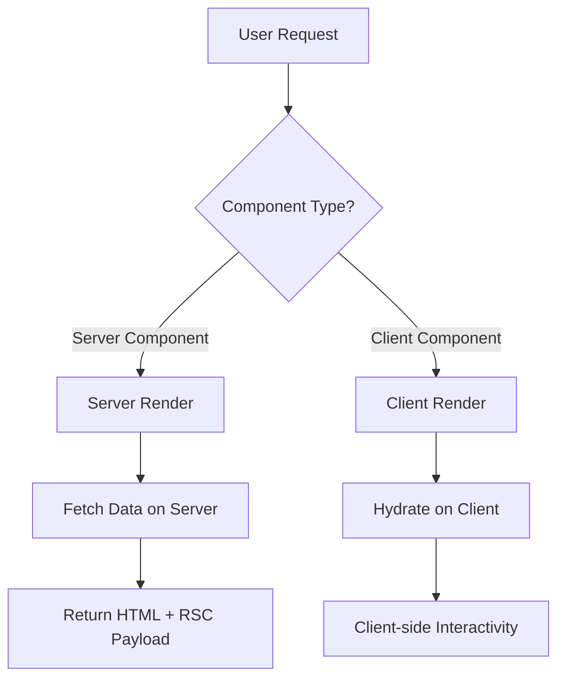
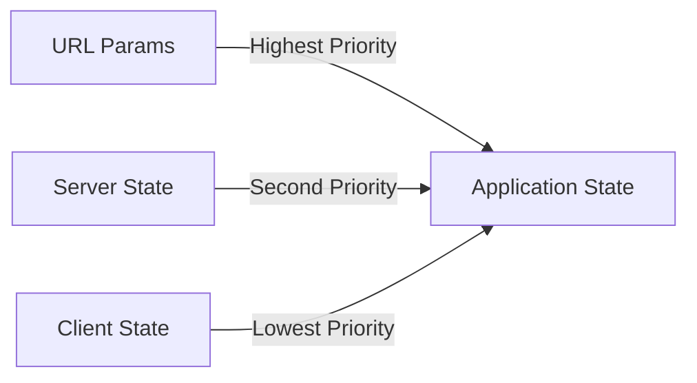
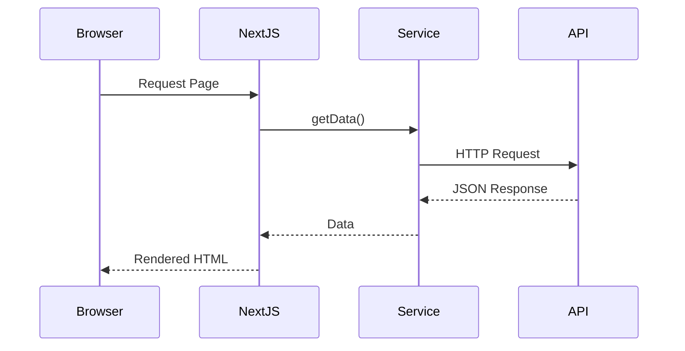
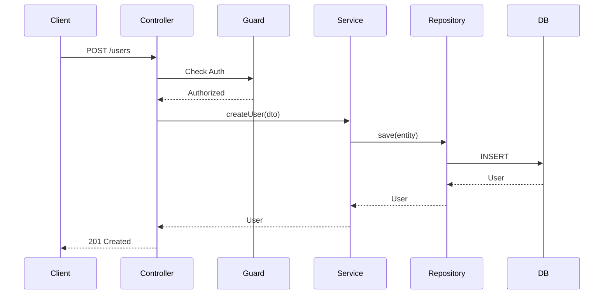
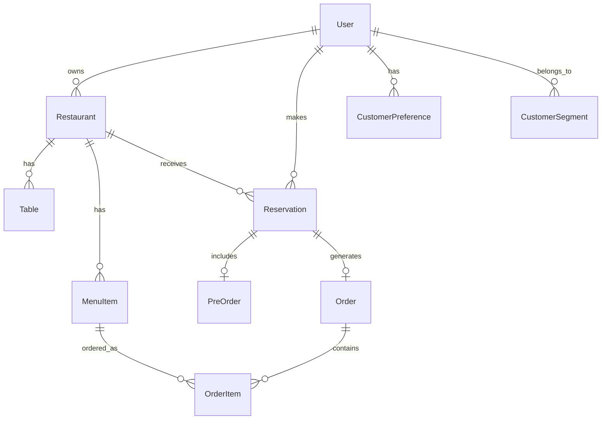
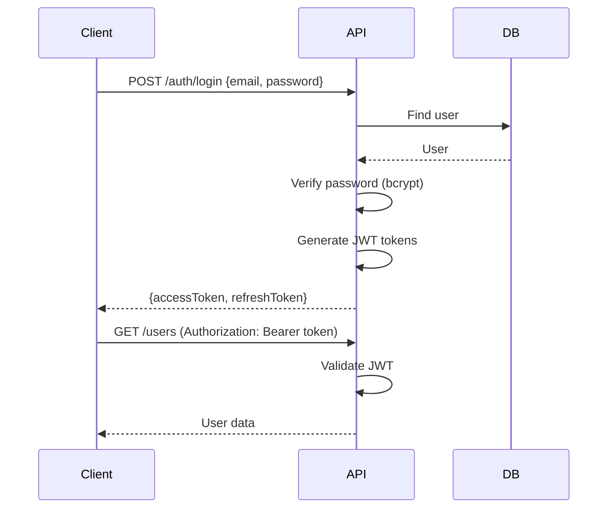
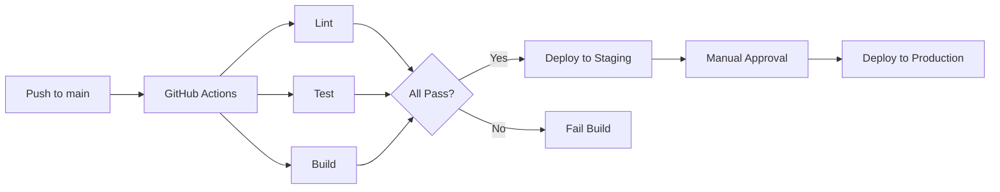

# 🏗️ Arquitectura de YumYum

Este documento describe la arquitectura técnica del sistema YumYum.

## 📋 Tabla de Contenidos

- [Vista General](#vista-general)
- [Arquitectura del Monorepo](#arquitectura-del-monorepo)
- [Frontend Architecture](#frontend-architecture)
- [Backend Architecture](#backend-architecture)
- [Base de Datos](#base-de-datos)
- [Comunicación](#comunicación)
- [Seguridad](#seguridad)
- [Escalabilidad](#escalabilidad)

## 🌐 Vista General

YumYum es un sistema SaaS multi-tenant para gestión de restaurantes, construido como un monorepo con las siguientes tecnologías principales:

### Tech Stack

**Frontend:**

- Next.js 14 (App Router)
- TypeScript
- Tailwind CSS + shadcn/ui
- Zustand (state management)
- Socket.IO client (real-time)

**Backend:**

- NestJS
- TypeScript
- PostgreSQL 15 + TypeORM
- Redis 7 (cache + queues)
- BullMQ (job processing)
- Socket.IO (real-time)

**Infrastructure:**

- Docker & Docker Compose
- Turborepo (monorepo management)
- pnpm (package manager)
- GitHub Actions (CI/CD)

## 📁 Arquitectura del Monorepo

```
yumyum/
├── fronts/                          # Frontend Monorepo
│   ├── apps/
│   │   ├── admin/                   # Admin Panel
│   │   ├── booking/                 # Public Booking Site
│   │   └── dashboard/               # Restaurant Dashboard
│   └── packages/
│       ├── ui/                      # Shared React Components
│       ├── types/                   # Shared TypeScript Types
│       ├── utils/                   # Shared Utilities
│       └── config/                  # Shared Configs
├── back/
│   └── api/                         # NestJS Backend
└── docs/                            # Documentation
```

### Principios del Monorepo

1. **Shared Code Packages** - Tipos, UI, utilidades compartidas
2. **Independent Apps** - Cada app puede deployarse independientemente
3. **Type Safety** - Tipos compartidos entre frontend y backend
4. **Build Optimization** - Turborepo para builds incrementales

## 🎨 Frontend Architecture

### Apps Structure

Cada aplicación frontend sigue esta estructura:

```
fronts/apps/[app-name]/
├── src/
│   ├── app/                         # Next.js App Router
│   │   ├── (auth)/                  # Route groups
│   │   ├── (dashboard)/
│   │   ├── api/                     # API routes
│   │   ├── layout.tsx
│   │   └── page.tsx
│   ├── components/                  # React components
│   │   ├── ui/                      # Local UI components
│   │   └── features/                # Feature-specific components
│   ├── lib/                         # Utilities
│   │   ├── api.ts                   # API client
│   │   └── utils.ts
│   ├── services/                    # Data fetching (Server Components)
│   │   ├── users.ts
│   │   └── restaurants.ts
│   ├── hooks/                       # Custom React hooks
│   │   └── useAuth.ts
│   └── store/                       # Client state (Zustand)
│       └── authStore.ts
├── public/                          # Static assets
├── package.json
├── next.config.js
└── tailwind.config.ts
```

### Rendering Strategy



**Server Components (Default):**

- Data fetching
- SEO-critical pages
- Static content
- Layout components

**Client Components:**

- Forms with useState
- Interactive widgets
- Event handlers
- Browser APIs

### State Management Strategy



1. **URL as Source of Truth** - Search params, route params
2. **Server State** - Data from API (prefer Server Components)
3. **Client State** - UI state only (Zustand, useState)

### Data Flow



## 🏛️ Backend Architecture

### Layered Architecture

```
┌─────────────────────────────────┐
│      Controller Layer           │  ← HTTP handling, validation
├─────────────────────────────────┤
│      Service Layer              │  ← Business logic
├─────────────────────────────────┤
│      Repository Layer           │  ← Data access
├─────────────────────────────────┤
│      Database Layer             │  ← PostgreSQL
└─────────────────────────────────┘
```

### Module Structure

```
back/api/src/modules/users/
├── users.controller.ts              # HTTP endpoints
├── users.service.ts                 # Business logic
├── users.module.ts                  # Module definition
├── dto/
│   ├── create-user.dto.ts
│   └── update-user.dto.ts
├── entities/
│   └── user.entity.ts               # TypeORM entity
└── guards/
    └── user-ownership.guard.ts      # Authorization
```

### Request Flow



### Dependency Injection

```typescript
@Module({
  imports: [TypeOrmModule.forFeature([User])],
  controllers: [UsersController],
  providers: [UsersService],
  exports: [UsersService],
})
export class UsersModule {}
```

## 🗄️ Base de Datos

### Schema Overview



### Core Entities

**Users:**

- Super admins
- Restaurant owners
- Restaurant staff
- Customers

**Restaurants:**

- Multi-tenant isolation
- Custom theming
- Configuration settings

**Reservations:**

- Date/time slots
- Party size
- Status tracking
- Pre-orders

**Menu:**

- Categories
- Items
- Pricing
- Allergens

**Intelligence Engine:**

- Customer preferences
- ML predictions
- Segmentation

### Indexes

```sql
-- Performance-critical indexes
CREATE INDEX idx_reservations_restaurant_date ON reservations(restaurant_id, date);
CREATE INDEX idx_reservations_customer ON reservations(customer_id);
CREATE INDEX idx_orders_restaurant_status ON orders(restaurant_id, status);
CREATE INDEX idx_menu_items_restaurant ON menu_items(restaurant_id);
```

### Migrations Strategy

1. **TypeORM Migrations** - Version controlled
2. **Never Sync in Production** - Always use migrations
3. **Rollback Support** - Every migration has down()
4. **Data Migrations** - Separate from schema changes

## 🔄 Comunicación

### REST API

**Convenciones:**

```
GET    /api/restaurants           # List
GET    /api/restaurants/:id       # Get one
POST   /api/restaurants           # Create
PUT    /api/restaurants/:id       # Update (full)
PATCH  /api/restaurants/:id       # Update (partial)
DELETE /api/restaurants/:id       # Delete
```

**Response Format:**

```typescript
{
  success: true,
  data: { ... },
  message: "Operation successful"
}

// Errors
{
  success: false,
  error: "Error message",
  statusCode: 400
}

// Paginated
{
  data: [...],
  total: 100,
  page: 1,
  pageSize: 20,
  totalPages: 5
}
```

### WebSockets (Socket.IO)

**Events:**

```typescript
// Client → Server
socket.emit('reservation:create', data);
socket.emit('order:update', { orderId, status });

// Server → Client
socket.on('reservation:confirmed', reservation => {});
socket.on('table:available', table => {});

// Room-based
socket.join(`restaurant:${restaurantId}`);
io.to(`restaurant:${restaurantId}`).emit('order:new', order);
```

**Use Cases:**

- Real-time reservation updates
- Table availability changes
- Order status updates
- Dashboard live metrics

### Queues (BullMQ)

```typescript
// Producer
await reservationQueue.add('send-confirmation', {
  reservationId: '...',
  method: 'whatsapp',
});

// Consumer
@Process('send-confirmation')
async handleConfirmation(job: Job) {
  const { reservationId } = job.data;
  await this.whatsappService.sendConfirmation(reservationId);
}
```

**Queue Types:**

- Email notifications
- WhatsApp messages
- Report generation
- Data exports
- ML predictions

## 🔒 Seguridad

### Authentication Flow



### JWT Strategy

```typescript
{
  accessToken: {
    payload: { sub: userId, email, role },
    expiresIn: '15m'
  },
  refreshToken: {
    payload: { sub: userId },
    expiresIn: '7d'
  }
}
```

### Authorization

**Guards:**

```typescript
@UseGuards(JwtAuthGuard)           // Requires valid JWT
@UseGuards(RolesGuard)             // Requires specific role
@Roles('admin', 'owner')           // Admin or Owner only
```

**Multi-tenancy:**

```typescript
// Automatic restaurant filtering
@Get()
findAll(@CurrentUser() user: User) {
  return this.service.findAll({
    where: { restaurantId: user.restaurantId }
  });
}
```

### Security Measures

1. **Password Hashing** - bcrypt with salt rounds 10
2. **Rate Limiting** - 100 requests/minute per IP
3. **CORS** - Whitelist specific origins
4. **Helmet** - Security headers
5. **Input Validation** - class-validator on all DTOs
6. **SQL Injection Prevention** - TypeORM parameterized queries
7. **XSS Prevention** - Content Security Policy
8. **CSRF Protection** - SameSite cookies

## 📈 Escalabilidad

### Horizontal Scaling

```
┌─────────────┐
│   Vercel    │  ← Frontend (Admin, Booking, Dashboard)
│   CDN/Edge  │     Auto-scaling, Global distribution
└─────────────┘

┌─────────────┐
│ Load        │
│ Balancer    │
└──────┬──────┘
       │
   ┌───┴───┬───────┬───────┐
   │       │       │       │
┌──▼──┐ ┌──▼──┐ ┌──▼──┐ ┌──▼──┐
│ API │ │ API │ │ API │ │ API │  ← NestJS instances
└──┬──┘ └──┬──┘ └──┬──┘ └──┬──┘
   │       │       │       │
   └───┬───┴───┬───┴───────┘
       │       │
    ┌──▼──┐ ┌─▼────┐
    │ PG  │ │ Redis│
    │ DB  │ │Cache │
    └─────┘ └──────┘
```

### Caching Strategy

**Levels:**

1. **CDN Cache** (Vercel Edge)
   - Static assets
   - ISR pages

2. **Redis Cache**
   - Restaurant data (1 hour)
   - Menu items (30 min)
   - User sessions

3. **Next.js Cache**
   - fetch() with revalidate
   - Server Components memoization

4. **Database Query Cache**
   - TypeORM query result cache

### Performance Optimizations

**Frontend:**

- Code splitting (dynamic imports)
- Image optimization (next/image)
- Font optimization (next/font)
- Route prefetching
- ISR (Incremental Static Regeneration)

**Backend:**

- Connection pooling (PostgreSQL)
- Query optimization (indexes)
- Lazy loading (TypeORM relations)
- Pagination (never return full lists)
- Background jobs (BullMQ)

### Monitoring

**Metrics:**

- Response times
- Error rates
- Active users
- Database query performance
- Cache hit/miss rates
- Queue job status

**Tools:**

- Application logs (Winston/Pino)
- APM (New Relic / Datadog)
- Error tracking (Sentry)
- Uptime monitoring (Pingdom)

## 🚀 Deployment

### Environments

```
Development  → Local (Docker Compose)
Staging      → Railway (Backend) + Vercel (Frontend)
Production   → AWS ECS (Backend) + Vercel (Frontend)
```

### CI/CD Pipeline



---

**Este documento debe actualizarse cuando se realicen cambios arquitectónicos significativos.**
