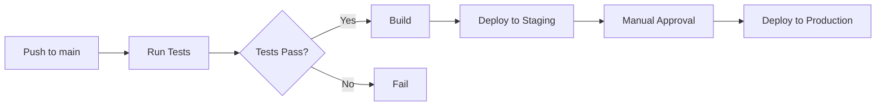

# 🚀 Guía de Deployment - YumYum

Esta guía describe cómo deployar YumYum en diferentes entornos.

## 📋 Tabla de Contenidos

- [Prerequisitos](#prerequisitos)
- [Variables de Entorno](#variables-de-entorno)
- [Frontend (Vercel)](#frontend-vercel)
- [Backend (Railway / AWS)](#backend-railway--aws)
- [Base de Datos](#base-de-datos)
- [CI/CD](#cicd)
- [Dominios](#dominios)
- [Troubleshooting](#troubleshooting)

## 🔧 Prerequisitos

### Servicios Necesarios

- **Vercel Account** (Frontend)
- **Railway / AWS Account** (Backend)
- **PostgreSQL Database** (Supabase / RDS)
- **Redis** (Upstash / ElastiCache)
- **GitHub Repository** (CI/CD)

### Herramientas

```bash
# Vercel CLI
npm i -g vercel

# Railway CLI (opcional)
npm i -g railway

# AWS CLI (si usas AWS)
pip install awscli
```

## 🔐 Variables de Entorno

### Frontend Apps

Cada app frontend necesita estas variables:

**Admin (`fronts/apps/admin/.env.local`):**

```bash
NEXT_PUBLIC_API_URL=https://api.yumyum.com/api
NEXT_PUBLIC_WS_URL=wss://api.yumyum.com
NEXT_PUBLIC_APP_URL=https://admin.yumyum.com
NEXT_PUBLIC_APP_NAME=YumYum Admin
```

**Booking (`fronts/apps/booking/.env.local`):**

```bash
NEXT_PUBLIC_API_URL=https://api.yumyum.com/api
NEXT_PUBLIC_WS_URL=wss://api.yumyum.com
NEXT_PUBLIC_APP_URL=https://yumyum.com
NEXT_PUBLIC_WOMPI_PUBLIC_KEY=pub_prod_xxxxx
NEXT_PUBLIC_ENABLE_PRE_ORDER=true
NEXT_PUBLIC_ENABLE_TABLE_ORDER=true
NEXT_PUBLIC_ENABLE_PAYMENTS=true
```

**Dashboard (`fronts/apps/dashboard/.env.local`):**

```bash
NEXT_PUBLIC_API_URL=https://api.yumyum.com/api
NEXT_PUBLIC_WS_URL=wss://api.yumyum.com
NEXT_PUBLIC_APP_URL=https://dashboard.yumyum.com
NEXT_PUBLIC_ENABLE_ANALYTICS=true
NEXT_PUBLIC_ENABLE_MARKETING=true
NEXT_PUBLIC_ENABLE_CRM=true
```

### Backend API

**Backend (`back/api/.env`):**

```bash
# Application
NODE_ENV=production
PORT=4000
API_PREFIX=api
APP_NAME=YumYum API

# Database (Production)
DB_HOST=your-db-host.amazonaws.com
DB_PORT=5432
DB_USERNAME=yumyum_prod
DB_PASSWORD=xxxxx
DB_DATABASE=yumyum_prod
DB_SYNCHRONIZE=false
DB_LOGGING=false
DB_SSL=true

# Redis (Production)
REDIS_HOST=your-redis-host.upstash.io
REDIS_PORT=6379
REDIS_PASSWORD=xxxxx
REDIS_TLS=true

# JWT
JWT_SECRET=super-secret-production-key-change-this
JWT_EXPIRES_IN=15m
JWT_REFRESH_SECRET=super-secret-refresh-key-change-this
JWT_REFRESH_EXPIRES_IN=7d

# CORS
CORS_ORIGINS=https://admin.yumyum.com,https://yumyum.com,https://dashboard.yumyum.com

# WhatsApp (Meta Business API)
META_WHATSAPP_PHONE_NUMBER_ID=xxxxx
META_WHATSAPP_ACCESS_TOKEN=xxxxx
META_WHATSAPP_WEBHOOK_VERIFY_TOKEN=xxxxx

# Payments (Wompi Production)
WOMPI_PUBLIC_KEY=pub_prod_xxxxx
WOMPI_PRIVATE_KEY=prv_prod_xxxxx
WOMPI_EVENTS_SECRET=xxxxx
WOMPI_SANDBOX=false

# Email (SendGrid)
EMAIL_ENABLED=true
EMAIL_FROM=noreply@yumyum.com
EMAIL_PROVIDER=sendgrid
SENDGRID_API_KEY=SG.xxxxx

# Monitoring
SENTRY_DSN=https://xxxxx@sentry.io/xxxxx

# Rate Limiting
THROTTLE_TTL=60
THROTTLE_LIMIT=100
```

## 🎨 Frontend (Vercel)

### Deployment Automático

#### 1. Conectar GitHub a Vercel

1. Ve a [vercel.com](https://vercel.com)
2. Click "Import Project"
3. Selecciona tu repositorio `yumyum`

#### 2. Crear Proyectos Separados

**Proyecto 1: Admin**

```
Project Name: yumyum-admin
Framework Preset: Next.js
Root Directory: fronts/apps/admin
Build Command: cd ../.. && pnpm install && pnpm build --filter=@yumyum/admin
Output Directory: .next
Install Command: pnpm install
```

**Proyecto 2: Booking**

```
Project Name: yumyum-booking
Framework Preset: Next.js
Root Directory: fronts/apps/booking
Build Command: cd ../.. && pnpm install && pnpm build --filter=@yumyum/booking
Output Directory: .next
Install Command: pnpm install
```

**Proyecto 3: Dashboard**

```
Project Name: yumyum-dashboard
Framework Preset: Next.js
Root Directory: fronts/apps/dashboard
Build Command: cd ../.. && pnpm install && pnpm build --filter=@yumyum/dashboard
Output Directory: .next
Install Command: pnpm install
```

#### 3. Configurar Variables de Entorno

En cada proyecto de Vercel:

1. Settings → Environment Variables
2. Añadir todas las variables del `.env.example`
3. Seleccionar entornos: Production, Preview, Development

#### 4. Configurar Dominios

**Admin:**

- `admin.yumyum.com` → Production
- `admin-preview.yumyum.com` → Preview

**Booking:**

- `yumyum.com` → Production
- `*.yumyum.com` → Production (wildcard para subdominios)
- `preview.yumyum.com` → Preview

**Dashboard:**

- `dashboard.yumyum.com` → Production
- `dashboard-preview.yumyum.com` → Preview

### Deployment Manual (CLI)

```bash
# Instalar Vercel CLI
npm i -g vercel

# Login
vercel login

# Deploy Admin (Production)
cd fronts/apps/admin
vercel --prod

# Deploy Booking (Production)
cd ../booking
vercel --prod

# Deploy Dashboard (Production)
cd ../dashboard
vercel --prod
```

### Configuración de Vercel

Crear `vercel.json` en cada app si necesitas configuraciones especiales:

```json
{
  "buildCommand": "cd ../.. && pnpm build --filter=@yumyum/admin",
  "framework": "nextjs",
  "regions": ["iad1"],
  "env": {
    "NEXT_PUBLIC_API_URL": "@api-url"
  }
}
```

## 🏗️ Backend (Railway / AWS)

### Opción 1: Railway (Recomendado para MVP)

#### 1. Setup Inicial

```bash
# Instalar Railway CLI
npm i -g railway

# Login
railway login

# Crear proyecto
railway init

# Link al repo
railway link
```

#### 2. Configurar Service

1. Railway Dashboard → New Project
2. Deploy from GitHub repo
3. Select `back/api` directory
4. Configure:
   - Build Command: `pnpm install && pnpm build`
   - Start Command: `pnpm start:prod`
   - Root Directory: `back/api`

#### 3. Añadir PostgreSQL

```bash
railway add postgresql
```

Esto creará automáticamente `DATABASE_URL` variable.

#### 4. Añadir Redis

```bash
railway add redis
```

Esto creará automáticamente `REDIS_URL` variable.

#### 5. Variables de Entorno

Railway Dashboard → Variables:

- Pegar todas las variables del `.env.example`
- Usar las variables generadas para DB y Redis

#### 6. Deploy

```bash
railway up
```

### Opción 2: AWS ECS (Producción)

#### 1. Crear Dockerfile

Ya tienes este archivo en `back/api/Dockerfile`:

```dockerfile
FROM node:20-alpine AS builder

WORKDIR /app

COPY package*.json pnpm-lock.yaml ./
COPY back/api/package.json ./back/api/

RUN npm install -g pnpm
RUN pnpm install --frozen-lockfile

COPY back/api ./back/api
RUN pnpm --filter @yumyum/api build

FROM node:20-alpine

WORKDIR /app

COPY --from=builder /app/back/api/dist ./dist
COPY --from=builder /app/back/api/node_modules ./node_modules
COPY --from=builder /app/back/api/package.json ./

EXPOSE 4000

CMD ["node", "dist/main"]
```

#### 2. Build y Push a ECR

```bash
# Login a AWS ECR
aws ecr get-login-password --region us-east-1 | docker login --username AWS --password-stdin <account-id>.dkr.ecr.us-east-1.amazonaws.com

# Build imagen
docker build -t yumyum-api -f back/api/Dockerfile .

# Tag
docker tag yumyum-api:latest <account-id>.dkr.ecr.us-east-1.amazonaws.com/yumyum-api:latest

# Push
docker push <account-id>.dkr.ecr.us-east-1.amazonaws.com/yumyum-api:latest
```

#### 3. Crear ECS Task Definition

```json
{
  "family": "yumyum-api",
  "networkMode": "awsvpc",
  "requiresCompatibilities": ["FARGATE"],
  "cpu": "512",
  "memory": "1024",
  "containerDefinitions": [
    {
      "name": "yumyum-api",
      "image": "<account-id>.dkr.ecr.us-east-1.amazonaws.com/yumyum-api:latest",
      "portMappings": [
        {
          "containerPort": 4000,
          "protocol": "tcp"
        }
      ],
      "environment": [
        { "name": "NODE_ENV", "value": "production" },
        { "name": "PORT", "value": "4000" }
      ],
      "secrets": [
        {
          "name": "DB_PASSWORD",
          "valueFrom": "arn:aws:secretsmanager:us-east-1:xxxxx:secret:yumyum/db-password"
        }
      ],
      "logConfiguration": {
        "logDriver": "awslogs",
        "options": {
          "awslogs-group": "/ecs/yumyum-api",
          "awslogs-region": "us-east-1",
          "awslogs-stream-prefix": "ecs"
        }
      }
    }
  ]
}
```

#### 4. Crear ECS Service

```bash
aws ecs create-service \
  --cluster yumyum-cluster \
  --service-name yumyum-api \
  --task-definition yumyum-api:1 \
  --desired-count 2 \
  --launch-type FARGATE \
  --network-configuration "awsvpcConfiguration={subnets=[subnet-xxx],securityGroups=[sg-xxx],assignPublicIp=ENABLED}" \
  --load-balancers "targetGroupArn=arn:aws:elasticloadbalancing:us-east-1:xxx:targetgroup/yumyum-api/xxx,containerName=yumyum-api,containerPort=4000"
```

## 🗄️ Base de Datos

### PostgreSQL Setup

#### Opción 1: Supabase (Managed)

1. Crear proyecto en [supabase.com](https://supabase.com)
2. Obtener connection string
3. Configurar en variables de entorno

#### Opción 2: AWS RDS

```bash
aws rds create-db-instance \
  --db-instance-identifier yumyum-prod-db \
  --db-instance-class db.t3.medium \
  --engine postgres \
  --engine-version 15.3 \
  --master-username yumyum_admin \
  --master-user-password xxxxx \
  --allocated-storage 20 \
  --vpc-security-group-ids sg-xxxxx \
  --db-subnet-group-name yumyum-subnet-group \
  --backup-retention-period 7 \
  --preferred-backup-window "03:00-04:00" \
  --preferred-maintenance-window "Mon:04:00-Mon:05:00"
```

### Migraciones

```bash
# Ejecutar migraciones en producción
cd back/api

# Verificar migraciones pendientes
pnpm migration:show

# Ejecutar migraciones
pnpm migration:run

# Rollback (si es necesario)
pnpm migration:revert
```

### Backup Strategy

**Automático (AWS RDS):**

- Snapshots diarios automáticos
- Retention: 7 días
- Point-in-time recovery habilitado

**Manual:**

```bash
# Backup
pg_dump -h your-db-host.com -U yumyum_prod -d yumyum_prod > backup_$(date +%Y%m%d).sql

# Restore
psql -h your-db-host.com -U yumyum_prod -d yumyum_prod < backup_20241225.sql
```

### Redis Setup

#### Opción 1: Upstash (Managed)

1. Crear database en [upstash.com](https://upstash.com)
2. Obtener Redis URL
3. Configurar en variables de entorno

#### Opción 2: AWS ElastiCache

```bash
aws elasticache create-cache-cluster \
  --cache-cluster-id yumyum-redis \
  --cache-node-type cache.t3.micro \
  --engine redis \
  --engine-version 7.0 \
  --num-cache-nodes 1 \
  --cache-subnet-group-name yumyum-redis-subnet \
  --security-group-ids sg-xxxxx
```

## 🔄 CI/CD

### GitHub Actions Setup

Los workflows ya están configurados en `.github/workflows/`.

#### Variables Secretas en GitHub

1. GitHub Repo → Settings → Secrets and variables → Actions
2. Añadir:

```
# Vercel
VERCEL_TOKEN
VERCEL_ORG_ID
VERCEL_PROJECT_ID_ADMIN
VERCEL_PROJECT_ID_BOOKING
VERCEL_PROJECT_ID_DASHBOARD

# Railway (o AWS)
RAILWAY_TOKEN

# AWS (si usas AWS)
AWS_ACCESS_KEY_ID
AWS_SECRET_ACCESS_KEY
AWS_REGION
ECR_REPOSITORY

# Otros
SENTRY_AUTH_TOKEN
```

### Workflow de Deploy



### Deploy Manual

```bash
# Trigger deploy manualmente
git tag v1.0.0
git push origin v1.0.0

# GitHub Actions detectará el tag y deployará
```

## 🌐 Dominios

### DNS Configuration

En tu proveedor de DNS (Cloudflare, Route53, etc.):

```
# A Records (o CNAME)
admin.yumyum.com        → Vercel IP
dashboard.yumyum.com    → Vercel IP
yumyum.com              → Vercel IP
*.yumyum.com            → Vercel IP (wildcard)
api.yumyum.com          → Railway/AWS Load Balancer

# CNAME (alternativa)
admin.yumyum.com        → cname.vercel-dns.com
dashboard.yumyum.com    → cname.vercel-dns.com
yumyum.com              → cname.vercel-dns.com
```

### SSL Certificates

**Vercel:**

- SSL automático via Let's Encrypt
- No requiere configuración

**Railway:**

- SSL automático incluido

**AWS:**

```bash
# Crear certificado en ACM
aws acm request-certificate \
  --domain-name api.yumyum.com \
  --validation-method DNS
```

## 🐛 Troubleshooting

### Frontend no Conecta con Backend

1. Verificar CORS en backend:

   ```typescript
   // main.ts
   app.enableCors({
     origin: ['https://admin.yumyum.com', 'https://yumyum.com'],
     credentials: true,
   });
   ```

2. Verificar variables de entorno:
   ```bash
   NEXT_PUBLIC_API_URL=https://api.yumyum.com/api  # Debe ser HTTPS
   ```

### Base de Datos No Conecta

1. Verificar security groups (AWS)
2. Verificar SSL mode:

   ```
   DB_SSL=true
   ```

3. Verificar connection string:
   ```bash
   # Test connection
   psql -h your-db.com -U user -d database
   ```

### Build Falla en Vercel

1. Verificar logs en Vercel Dashboard
2. Verificar build command:

   ```bash
   cd ../.. && pnpm install && pnpm build --filter=@yumyum/admin
   ```

3. Limpiar cache:
   - Vercel Dashboard → Deployments → Redeploy → Clear cache

### Redis Connection Issues

1. Verificar TLS:
   ```typescript
   // Redis config
   {
     host: process.env.REDIS_HOST,
     port: process.env.REDIS_PORT,
     password: process.env.REDIS_PASSWORD,
     tls: process.env.NODE_ENV === 'production' ? {} : undefined
   }
   ```

## 📊 Monitoring

### Health Checks

**Backend:**

```
https://api.yumyum.com/api/health
```

**Frontend:**

```
https://admin.yumyum.com/api/health
```

### Logs

**Vercel:**

- Vercel Dashboard → Logs
- Real-time logs: `vercel logs`

**Railway:**

- Railway Dashboard → Deployments → Logs
- CLI: `railway logs`

**AWS:**

```bash
aws logs tail /ecs/yumyum-api --follow
```

### Alertas

Configurar en:

- Sentry (errores)
- Uptime Robot (downtime)
- CloudWatch (AWS metrics)

## 🔄 Rollback

### Vercel

```bash
# Rollback a deployment anterior
vercel rollback
```

O desde el Dashboard: Deployments → Previous → Promote to Production

### Railway

Railway Dashboard → Deployments → Select previous → Redeploy

### AWS ECS

```bash
aws ecs update-service \
  --cluster yumyum-cluster \
  --service yumyum-api \
  --task-definition yumyum-api:previous-version
```

---

**Para soporte adicional, consulta la [documentación oficial](./README.md) o contacta al equipo de DevOps.**
